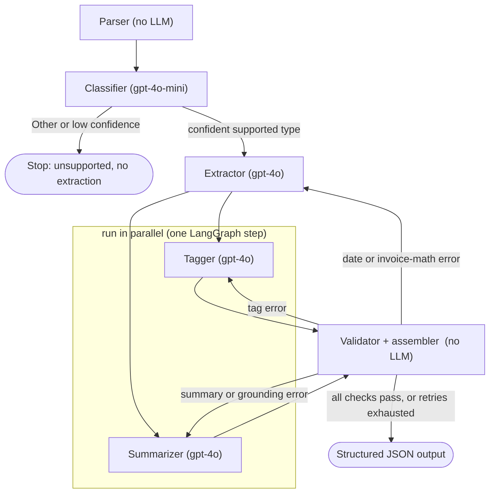

# Multi-Agent Document Processing Pipeline

Give it an unstructured business document (`.docx` or `.pdf`) and it returns clean structured
data: what the document is (classification), 3 to 7 semantic tags, type-specific key fields, and a
2 to 3 sentence summary, all as a single validated JSON object.

It is built as a multi-agent pipeline on [LangGraph](https://langchain-ai.github.io/langgraph/):
four specialised LLM agents (classify, extract, tag, summarize) coordinated by a deterministic
state machine, with deterministic (no-LLM) parsing and validation around them, and a bounded
self-correction loop. The LLM provider is OpenAI. The primary way to use it is a Streamlit web app.

---

## Demo

<!-- Paste your screen recording of the Streamlit UI here -->

> Demo video of the Streamlit UI will be added here.

---

## Table of contents

1. [What you get per document](#1-what-you-get-per-document)
2. [Quickstart (Streamlit app)](#2-quickstart-streamlit-app)
3. [Repository structure](#3-repository-structure)
4. [Architecture](#4-architecture)
5. [Component reference](#5-component-reference)
6. [The reliability model and validation checks](#6-the-reliability-model-and-validation-checks)
7. [End-to-end walkthrough (one invoice, function by function)](#7-end-to-end-walkthrough)
8. [Extraction schemas](#8-extraction-schemas)
9. [Evaluation](#9-evaluation)
10. [Cost](#10-cost)
11. [Design decisions and trade-offs](#11-design-decisions-and-trade-offs)
12. [Known limitations](#12-known-limitations)
13. [What I would build with more time](#13-what-i-would-build-with-more-time)
14. [Further reading](#14-further-reading)

---

## 1. What you get per document

Every document produces one JSON object in this shape (real output for the sample invoice):

```json
{
  "source_file": "doc_004_invoice.pdf",
  "classification": {
    "document_type": "Invoice",
    "confidence": 0.95,
    "signals": ["Invoice Number ENT-INV-2024-0043", "TOTAL DUE: ₹14,16,000", "Payment Terms Net-30"]
  },
  "tags": ["invoice", "net-30", "milestone-based", "change-order", "gst", "cloud-infrastructure", "late-payment-fee"],
  "extracted_fields": { "...type-specific schema, every key present, null when absent..." },
  "summary": "An invoice from Ententia AI Solutions to NovaBridge Financial Services for ₹14,16,000 ...",
  "pipeline_meta": {
    "model_calls": 4,
    "retries": {"extract": 0, "tag": 0, "summarize": 0},
    "validation_errors_fixed": [],
    "validation_errors_unresolved": [],
    "duration_seconds": 5.4
  }
}
```

Guarantees enforced by the pipeline:

- Absent fields are `null`, never omitted, so the JSON shape is stable regardless of content.
- Tags are 3 to 7, lowercase, hyphen-separated (`^[a-z0-9]+(-[a-z0-9]+)*$`), content-grounded.
- Summary is 2 to 3 plain-language sentences.
- Dates are ISO `YYYY-MM-DD`. Currency is preserved exactly as written, so Indian digit grouping
  stays (`₹40,00,000`, not `₹4,000,000`).
- `pipeline_meta` makes the run observable: how many model calls, which stages retried, what the
  validator fixed or could not, and how long it took.

---

## 2. Quickstart (Streamlit app)

**Requirements:** Python 3.11+ and an OpenAI API key.

```bash
# 1. Install dependencies (use a fresh venv or conda env)
python -m venv .venv && source .venv/bin/activate     # or: conda create -n docpipe python=3.12
pip install -r requirements.txt

# 2. Configure your key
cp .env.example .env          # then edit .env and set OPENAI_API_KEY=sk-...

# 3. Launch the web app
PYTHONPATH=src streamlit run app.py
```

A browser tab opens with two pages in the sidebar:

**Process documents (the main page).** Drag in one or more `.docx` / `.pdf` files and click
**Run pipeline**. For each file the app:

1. parses it and classifies it;
2. if it is one of the four supported types and the classifier is confident, runs the full
   pipeline and shows, in a per-file tab, the **document type and confidence**, the **tags**, the
   **extracted fields** (as JSON), and the **summary**;
3. if it classifies as **Other** or below the confidence threshold, it stops and shows a clear
   "unsupported document" message instead of guessing.

It works on any uploaded document, not just the samples.

**Evaluation page.** Upload the sample documents to score them against their ground truth. It
shows a batch results table (per-document classification, field accuracy, tag Jaccard, summary
score) with an aggregate row and a pass/fail gate, then per-document metrics and the full
field-by-field report (viewable inline and downloadable).

### Command line (optional, for batch or CI)

The same pipeline is available headless:

```bash
PYTHONPATH=src python -m cli run data/samples/        # all docs -> output/*.json + a table
PYTHONPATH=src python -m cli run --doc data/samples/doc_004_invoice.pdf   # one document
PYTHONPATH=src python -m cli eval                     # score vs ground truth (exit code = gate)
pytest                                                # test suite, no API key needed (LLM mocked)
```

> The UI, the CLI, and the eval all call the exact same compiled graph (`run_pipeline`), in-process.
> No API server is involved.

> `cli eval` scores the JSON already in `output/` and only runs the pipeline for documents whose
> output is missing. To force fresh scoring after changing prompts, re-run `cli run` first (or
> delete `output/`).

---

## 3. Repository structure

```
.
├── README.md                  # this file
├── FINDINGS.md                # empirical log: every problem found, the fix, and why
├── EVAL_SCORING.md            # exactly how the evaluator scores each field
├── requirements.txt
├── .env.example               # OPENAI_API_KEY + model/threshold overrides
├── pytest.ini                 # pythonpath=src for tests
├── run.sh                     # convenience CLI wrapper
│
├── app.py                     # Streamlit page 1: process documents (product view)
├── pages/2_Evaluation.py      # Streamlit page 2: score vs ground truth
├── ui_common.py               # shared UI helpers (reuses eval functions, no duplicated logic)
│
├── data/
│   ├── samples/               # the 4 input documents
│   └── ground_truth.json      # expected outputs, transcribed from expected_outputs.docx
├── output/                    # all generated results committed: per-doc JSON + eval reports
│
├── src/
│   ├── config.py              # models, thresholds, paths, all env-overridable
│   ├── parsing.py             # docx/pdf to text (+ deterministic rupee-glyph repair). No LLM.
│   ├── llm.py                 # the ONLY file that calls OpenAI (forced-tool wrapper + embeddings)
│   ├── prompts.py             # extraction preamble + one prompt per document type
│   ├── registry.py            # document_type -> (schema, prompt). Code-level routing table.
│   ├── validation.py          # deterministic checks (tags, dates, invoice math, grounding). No LLM.
│   ├── graph.py               # LangGraph wiring: nodes, edges, fan-out, retry, assembly
│   ├── cli.py                 # python -m cli run|eval
│   ├── agents/
│   │   ├── classifier.py      # type + confidence + signals  (gpt-4o-mini)
│   │   ├── extractor.py       # one class, parameterised by (schema, prompt)  (gpt-4o)
│   │   ├── tagger.py          # 3 to 7 semantic tags  (gpt-4o)
│   │   └── summarizer.py      # 2 to 3 sentence summary  (gpt-4o)
│   └── schemas/
│       ├── common.py          # Classification, TagSet, Summary, PipelineMeta, FinalOutput
│       ├── vendor_contract.py # ContractFields
│       ├── support_ticket.py  # TicketFields
│       ├── statement_of_work.py # SOWFields
│       └── invoice.py         # InvoiceFields
│
├── eval/
│   ├── evaluate.py            # scoring harness (classification, fields, tags, summary) + gate
│   └── report.py              # per-document markdown reports (field-by-field tables)
└── tests/                     # pytest, no API key needed (LLM mocked)
    ├── test_parsing.py
    ├── test_schemas.py
    ├── test_validation.py
    └── test_graph_routing.py
```

---

## 4. Architecture

The pipeline is a directed graph of stages. Two stages are pure deterministic code (parser,
validator); four are LLM agents. Routing decisions are made by code reading the classifier's
structured output, never by an LLM choosing its own path.



Reading the diagram:

- **Parallel branch.** After the extractor finishes, the tagger and the summarizer both start.
  They depend only on the extraction (not on each other), so LangGraph runs them in the same step.
  Both then feed the validator, which waits for both before running. They write different state
  keys, so there is no conflict; shared counters (`model_calls`, `retry_counts`) use LangGraph
  reducers to merge the two concurrent writes safely.
- **The retry edges are conditional and each targets exactly one stage.** The validator labels
  every failure with the stage responsible for it; the router then sends the run back to that one
  stage with the specific error messages appended to its prompt, so the agent can self-correct.
  The classifier is never retried. Each stage retries at most `MAX_RETRIES_PER_STAGE` (2) times;
  if it still fails, the pipeline emits the output anyway with `validation_errors_unresolved`
  populated rather than crashing the batch.
- **Why a retry can go back to the extractor.** The extractor owns the fields, so the two
  field-level validation checks route to it: a `*_date` value that is not ISO `YYYY-MM-DD`, or an
  invoice whose arithmetic does not reconcile (line items vs subtotal, subtotal x GST vs GST
  amount, subtotal + GST vs total, or a Net-30 due date that is not invoice date + 30 days). When
  either fails, the extractor re-runs with the failing checks quoted back to it. On the four clean
  samples this never fires (0 extract retries), but it is the safety net for a malformed date or a
  number the model misread. Tag-format failures route to the tagger; sentence-count or
  summary-grounding failures route to the summarizer. The full mapping is the table in
  [section 6](#6-the-reliability-model-and-validation-checks).
- **Classify-gate.** If the document classifies as `Other` or below the confidence threshold, the
  run stops right after classification. No extraction is attempted. See
  [section 11](#11-design-decisions-and-trade-offs) for why this replaced an open-schema fallback.

### Why LangGraph, and why "multi-agent" here means orchestrated specialists

This workflow is a known, fixed DAG. No step's control flow benefits from LLM judgement: the
classifier's output is consumed by plain Python (`registry[document_type]`) to pick the extractor.
So the agents are specialised workers (each one role, one prompt, one model tier, one forced
output schema), and LangGraph is the orchestrator that wires them, runs the parallel branch, and
implements the bounded retry loop.

I deliberately did not use an autonomous-agent framework (a single LLM choosing among four
extraction tools in a ReAct loop). For a deterministic DAG that adds a new failure mode (the model
choosing the wrong tool) and nondeterminism, without adding any capability. The genuinely agentic
behaviour I do want, an agent revising its own output after a critique, is captured by the
validator and retry loop, which is bounded and inspectable.

---

## 5. Component reference

| Component | File | LLM? | Responsibility |
|---|---|---|---|
| Parser | `src/parsing.py` | No | `.docx` to paragraphs + tables-as-markdown (document order preserved); `.pdf` to text. Deterministic rupee-glyph repair (see below). |
| LLM wrapper | `src/llm.py` | yes | The only file that calls OpenAI. `call_structured()` forces the model to answer in a Pydantic schema (function-calling, forced tool choice, `temperature=0`), validates the result, retries transport errors with backoff. Also `embed_texts()` for the eval. |
| Prompts | `src/prompts.py` | No | Shared extraction preamble + one prompt per type. Every prompt is a named constant, no inline f-string soup. |
| Registry | `src/registry.py` | No | `EXTRACTORS: {document_type -> (schema, prompt)}`. The code-level routing table. |
| Classifier | `src/agents/classifier.py` | gpt-4o-mini | First ~2,000 chars to `document_type` + `confidence` + 1 to 3 verbatim `signals`. Prompt encodes the invoice-vs-SOW boundary. |
| Extractor | `src/agents/extractor.py` | gpt-4o | One class, parameterised by `(schema, prompt)` from the registry. One forced-schema call per document. `config_for(type)` is the routing function. |
| Tagger | `src/agents/tagger.py` | gpt-4o | 3 to 7 content-grounded tags. Format rules are enforced at the schema level (`TagSet`), so format retries are rare. |
| Summarizer | `src/agents/summarizer.py` | gpt-4o | 2 to 3 sentence summary, grounded in the extracted fields (amounts it mentions must appear in the fields). |
| Validator | `src/validation.py` | No | Deterministic checks to `{stage: [errors]}` so the graph knows which stage to retry. |
| Graph | `src/graph.py` | No | `PipelineState`, the six nodes, the two conditional edges (classify-gate, retry), output assembly. |
| CLI | `src/cli.py` | No | `run` (write `output/*.json` + table) and `eval`. |
| Eval | `eval/evaluate.py`, `eval/report.py` | embeddings only | Scores output vs ground truth; writes per-doc field-by-field reports. |
| UI | `app.py`, `pages/`, `ui_common.py` | No | Streamlit: a Process page (product view) and an Evaluation page. Calls the compiled graph in-process. |

**Parser normalisation, the rupee-glyph repair.** Both sample PDFs render the rupee sign as a
capital `I` (for example `I14,16,000`). The parser replaces `■`/`I` immediately before a digit
with `₹`, but only when the document shows Indian-currency context (GSTIN, IFSC, crore, lakh, or
GST present). This guarantees dollar-denominated documents are never touched. Chosen over a prompt
fix because the model, told to copy currency exactly, faithfully copies the corruption;
determinism is cheaper and testable here. Full reasoning: `FINDINGS.md` section 1.

---

## 6. The reliability model and validation checks

Structured output guarantees shape, not correctness. The pipeline layers four mechanisms so the
final JSON is trustworthy:

| Layer | Mechanism | Catches |
|---|---|---|
| 1 | Forced function call (`tool_choice`) | Guarantees valid JSON of the right shape, never prose, never a refusal. |
| 2 | JSON-Schema constraints (types, the 5-type enum, list min/max) | Things the API can enforce or be strongly guided by. |
| 3 | Pydantic re-validation + `validation.py` | Everything the schema cannot express: tag regex, ISO dates, invoice arithmetic, summary grounding. |
| 4 | Bounded retry (max 2 per stage, error fed back to the agent) | Transient model mistakes; the agent revises its own output given the specific failure messages. |

A concrete example of why layers 3 and 4 exist: the tagger once returned `sla-99.9` (encoding
"99.9% SLA"). The dot violates the tag regex, but the JSON schema sent to the model could not
express that rule (a Pydantic `@field_validator` is Python, not serialisable into JSON Schema), so
the model never saw it. Layer 3 caught it; layer 4 would re-prompt to fix it. Full write-up:
`FINDINGS.md` section 8.

### What the validator checks

Every field is also re-validated against the Pydantic schema (type, nullability, no extra keys).
Beyond that, `validation.py` runs these deterministic checks, each tagged with the stage it routes
back to on failure:

| Check | Applies to | Verifies | Retry stage |
|---|---|---|---|
| Schema re-validation | all components | declared type, `null` allowed, no unknown keys | (raised in the call, then stage retry) |
| Tag rules | `tags` | count is 3 to 7, each matches the regex, no duplicates | tag |
| Summary shape | `summary` | 2 to 3 sentences (abbreviation-aware, so "Pvt. Ltd." is not miscounted), non-empty | summarize |
| Summary grounding | `summary` vs `extracted_fields` | every monetary amount in the summary appears in the fields | summarize |
| Date format | every `*_date` field | ISO `YYYY-MM-DD`, or `null` | extract |
| Invoice arithmetic | invoice `line_items` + `totals` | sum(line amounts) = subtotal; subtotal x GST rate = GST amount; subtotal + GST = total (Indian-number-aware, plus or minus 1 rupee); Net-30 implies due date = invoice date + 30 days | extract |

---

## 7. End-to-end walkthrough

When you upload `doc_004_invoice.pdf` in the UI (or run it via the CLI), the same
`graph.run_pipeline(path)` executes:

1. **`run_pipeline`** builds the initial `PipelineState` and calls `COMPILED_GRAPH.invoke(...)`.
2. **`parse_node`** calls `parsing.parse_document()`, which calls `parse_pdf()` (PyMuPDF) then
   `_repair_rupee()`. The text now contains `₹14,16,000` instead of `I14,16,000`.
3. **`classify_node`** calls `agents.classifier.classify()`, which calls
   `llm.call_structured(model=gpt-4o-mini, schema=Classification)`. Returns `Invoice`, `0.95`,
   signals. (LLM call 1.)
4. **`route_after_classify`** sees `Invoice` is supported and `0.95 >= 0.7`, so it returns
   `"extract"`. (Had it been `Other` or below the threshold it would return `END` and stop here,
   which is what the UI's "unsupported document" message reflects.)
5. **`extract_node`** calls `config_for("Invoice")` to get `(InvoiceFields, INVOICE_PROMPT)`, then
   `Extractor.run()` calls `llm.call_structured(model=gpt-4o, schema=InvoiceFields)`. Returns the
   fields dict (ISO dates, verbatim rupee amounts, line items, payment instructions). (Call 2.)
6. **Fan-out:** `tag_node` and `summarize_node` run in parallel, each receiving the document text
   plus the extracted fields, calling `call_structured(gpt-4o, TagSet)` and `(..., Summary)`.
   (Calls 3 and 4.)
7. **`validate_node`** calls `validation.validate("Invoice", fields, tags, summary)` and runs the
   date, invoice-arithmetic, tag, summary, and grounding checks. The sample invoice reconciles
   (`₹10,00,000 + ₹1,40,000 + ₹60,000 = ₹12,00,000`; times 18% = `₹2,16,000`; total `₹14,16,000`),
   so it returns no errors.
8. **`route_after_validate`** sees no errors and returns `END`. On a failure it would route back
   to the one failing stage and increment its retry count, capped at 2.
9. **`_assemble`** packs everything into a `FinalOutput` with `pipeline_meta` (4 calls, 0 retries,
   duration). The UI renders it; the CLI writes `output/doc_004_invoice.json`.

---

## 8. Extraction schemas

Routing picks one closed schema per type (`src/schemas/`). Every field is `Optional` (defaults to
`null`); every model sets `extra="forbid"` so the model cannot invent keys.

| Type | Top-level fields (grouped) |
|---|---|
| Vendor Contract | `parties_and_dates` (parties, effective/expiry dates); `commercial_terms` (contract_value, payment_terms); `renewal_and_termination` (auto_renewal, notice periods); `legal` (governing_law, dispute_resolution, liability_cap) |
| Support Ticket | `ticket_metadata` (id, submitted_by, date, priority, category, system, assignee, status); `issue_details.description`; `resolution` (root_cause, resolved_by, time, notes) |
| Statement of Work | project_name, sow_number, client, vendor, start/end dates, total_budget; `deliverables[]`; `payment_milestones[]` (milestone, name, amount, due_date); `key_contacts[]` (role, name, email) |
| Invoice | invoice_number, invoice/due dates, payment_terms, reference_sow, vendor, client; `line_items[]` (description, qty, unit_price, amount); `totals` (subtotal, gst_rate, gst_amount, total_due); `payment_instructions` (bank, account, IFSC, UPI/email) |

---

## 9. Evaluation

The Evaluation page and `python -m cli eval` both score the pipeline against
`data/ground_truth.json`, and the CLI exits non-zero if classification is below 100% or aggregate
field accuracy is below 90% (CI-friendly). How each field is scored is documented in detail in
`EVAL_SCORING.md`; in brief:

- **Classification:** exact match (the gate).
- **Fields:** walk every ground-truth leaf. Identifiers, dates, codes, and amounts are matched
  exactly (amounts compared numerically, so `₹14,16,000` equals `₹ 14,16,000`); free-text fields
  by fuzzy similarity; both-null counts as a match. Lists of scalars are scored by Jaccard (so
  both missing and extra items are penalised); lists of objects are aligned and scored
  field-by-field for partial credit.
- **Tags:** strict exact-match Jaccard (informational, not gated; tag vocabulary is subjective,
  see `FINDINGS.md` section 9).
- **Summary:** a blend of lexical (`token_set_ratio`) and semantic (embedding cosine) similarity,
  with a graceful fall back to lexical-only if embeddings are unavailable (informational, not
  gated).

`eval/report.py` also writes a per-document markdown report (`output/eval_report_*.md`) with a
field-by-field table: field, schema type, ground truth, predicted, metric, score, match, and the
validation check that applies. These reports and the per-document `output/doc_*.json` are
committed to the repo, so the detailed results can be reviewed directly without running anything.

### Results

<!-- Paste the latest `python -m cli eval` table here. -->

| Document | Classification | Field accuracy | Tag Jaccard | Summary score |
|---|---|---|---|---|
| doc_001 vendor contract | correct | 13/13 (100%) | 3/11 (27%) | 0.79 |
| doc_002 support ticket  | correct | 13/13 (100%) | 4/10 (40%) | 0.80 |
| doc_003 statement of work | correct | 45/49 (92%) | 4/10 (40%) | 0.77 |
| doc_004 invoice         | correct | 27/27 (100%) | 5/9 (56%)  | 0.77 |
| **Aggregate**           | **100% (4/4)** | **96% (98/102)** | | |
| **Gate**                | | **PASS** (needs 100% class, 90% fields) | | |

> Classification is 100% across the four samples and aggregate field accuracy is 96%, so the gate
> passes. The 4 residual field misses are all in the SOW: two milestone names and one contact name
> use ground-truth wording that does not appear verbatim in the document (for example
> "Architecture Sign-off", and "Ramesh Iyer (CTO)" where the document gives only "Ramesh Iyer"),
> plus the admin-dashboard deliverable that our section-level summary folds into the integration
> item. These are ground-truth phrasing differences, not extraction errors, and the eval reports
> each one explicitly. See [section 12](#12-known-limitations).
>
> Tag Jaccard uses strict exact-match. Steering the tagger toward short canonical category labels
> (standard terms and acronyms rather than document-specific phrases) roughly doubled per-document
> overlap (for example doc_004 from 3/11 to 5/9) without copying the expected outputs' vocabulary.
> The remaining gap is genuine, subjective vocabulary choice on a non-gated metric; the rationale
> and the before/after are in `FINDINGS.md` section 9.

---

## 10. Cost

Representative per-document cost on the happy path (4 model calls). Token counts are approximate
and vary by document; prices use gpt-4o at $2.50 / 1M input and $10 / 1M output tokens, and
gpt-4o-mini at $0.15 / $0.60.

| Stage | Model | ~Input tokens | ~Output tokens | ~Cost |
|---|---|---|---|---|
| Classify | gpt-4o-mini | 850 | 55 | $0.0002 |
| Extract | gpt-4o | 1,500 | 250 | $0.0063 |
| Tag | gpt-4o | 1,500 | 35 | $0.0041 |
| Summarize | gpt-4o | 1,400 | 110 | $0.0046 |
| **Per document** | | | | **~$0.015 (about 1.5 cents)** |
| **Full sample run (4 docs)** | | | | **~$0.06** |

Notes: a retry (rare) adds at most two more calls to the affected stage. The eval's semantic
summary metric uses `text-embedding-3-small`, which is negligible and disk-cached, so repeated
evals do not re-pay for it. Putting classification on the cheap tier is deliberate: the document
type announces itself in the first page, so the small model is sufficient and the quality tier is
reserved for extraction, tagging, and summarising.

---

## 11. Design decisions and trade-offs

- **Classify then route with code-level routing** (vs one agent with four tools). The classifier
  emits a structured `document_type`; plain code selects the extractor. Deterministic, testable,
  and it removes the "model picks the wrong tool" failure mode.
- **One extractor class plus a schema registry** (vs four extractor classes). Adding a fifth
  document type is one schema file, one prompt, and one registry line, with no new control flow.
- **Closed schema per known type, classify-gate for the rest** (a deliberate change from an
  open-schema fallback). For a document we do not recognise, emitting half-confident "generic"
  fields is rarely useful and can mislead; stopping with an explicit unsupported signal is more
  honest and matches how the product UI behaves. The open-schema fallback (an LLM-proposed generic
  key/value extraction flagged for human review) remains the natural path for onboarding new types
  later, see [section 13](#13-what-i-would-build-with-more-time).
- **Tagger and summarizer as separate parallel nodes** (vs one combined call). Keeps retry
  isolation (a bad tag set does not force the summary to regenerate) and independent evaluation.
  Merging them into one call is a reasonable production cost optimisation (one fewer call per doc).
- **Model tiering.** Cheap gpt-4o-mini for classification, gpt-4o for extraction, tagging, and
  summarising where quality matters. See [section 10](#10-cost).
- **Deterministic everywhere an LLM is not required.** Parsing, the rupee repair, all validation,
  and all scoring are plain code: cheaper, reproducible, and unit-tested.
- **Currency preserved verbatim.** "₹40,00,000" stays in Indian notation; the validator and eval
  parse Indian grouping numerically rather than reformatting the source.

---

## 12. Known limitations

- **Ground-truth labels absent from the source.** Some expected values were paraphrased by the
  author of `expected_outputs.docx` and never appear in the document (for example the SOW
  milestone name "Architecture Sign-off" vs the document's "Architecture Decision Record, Data
  Handling Agreement"; a contact role "Engagement Manager" vs the document's "Co-Founder & CEO").
  No faithful extractor can reproduce these, so they read as misses; the eval reports them
  transparently. (`FINDINGS.md` section 6.)
- **SOW deliverables granularity (6 vs 7).** Our section-level summary keeps the admin dashboard
  inside the integration deliverable; ground truth splits it out. Forcing exactly 7 would mean
  hard-coding to this document, so we accept about 6/7 Jaccard. (`FINDINGS.md` Appendix B.)
- **File type is trusted from the extension.** No magic-byte sniffing; a misnamed file fails to
  parse rather than auto-detecting.
- **Tag vocabulary partially differs from ground truth.** The tagger is steered toward canonical
  category labels, which roughly doubled exact-match Jaccard, but some tags still differ from the
  expected outputs' specific wording on this non-gated, subjective metric. (`FINDINGS.md` section
  9.)

---

## 13. What I would build with more time

- **Parallel processing of documents.** Each document is independent and the work is
  I/O-bound (waiting on the API), so a batch of files can be processed concurrently. The simplest
  approach is a `concurrent.futures.ThreadPoolExecutor` mapping `run_pipeline` over the file list;
  a cleaner one is an `AsyncOpenAI` client with async LangGraph nodes driven by `asyncio.gather`.
  Within a single document the tagger and summarizer already run in parallel; this would add
  parallelism across documents, turning the 4-doc sample run from sequential into roughly one
  document's latency.
- **Open-schema fallback plus a human-review queue** for unrecognised types: an LLM-proposed
  generic key/value extraction flagged `needs_human_review`, which is the onboarding path for new
  document types.
- **Async batch and the OpenAI Batch API**, plus prompt caching of the shared preambles, to cut
  cost and latency at scale.
- **Cheaper-model trials to cut cost.** Extraction, tagging, and summarising currently use
  gpt-4o, but the model tier for each stage is already env-overridable (`MODEL_EXTRACT`,
  `MODEL_TAG`, `MODEL_SUMMARY`). Because the eval harness scores accuracy against ground truth,
  pointing a stage at a cheaper model (for example gpt-4o-mini, roughly 15 to 20 times cheaper per
  token) and re-running `cli eval` is a one-line, measurable experiment: keep the downgrade on any
  stage where the gate still passes. Tagging and summarising are the likeliest to hold up on a
  smaller model; extraction is the most accuracy-sensitive. This could push the per-document cost
  well below the current ~1.5 cents without sacrificing the gated metrics.
- **Push tag accuracy further.** Steering the tagger toward canonical category labels already
  roughly doubled exact-match Jaccard (now 27 to 56% per document, see section 9), but there is
  clear headroom on this strict metric. Next levers, in rough order of impact: (1) a **controlled
  tag vocabulary**, a curated taxonomy the tagger selects from (optionally plus one or two
  free-form tags), which is how production tagging stays consistent and is the biggest lever for
  exact overlap; (2) a light **post-tagging normalisation pass** that maps known synonyms to a
  canonical form (for example `cloud-services` to `saas`); (3) a **few-shot exemplar per document
  type** to anchor the expected vocabulary; and (4) if exact-match proves too strict for an
  inherently subjective field, add a **semantic (embedding) tag match** in the eval alongside the
  strict one. Levers 1 to 3 improve the product output; lever 4 only changes measurement.
- **Database persistence and a richer review UI**, including an analytics dashboard to visualise
  business impact: documents processed over time, accuracy and confidence trends, throughput, the
  total monetary value flowing through extracted invoices and SOWs, and a review queue for
  low-confidence outputs.
- **Schema induction** to propose new schemas from a handful of examples.

---

## 14. Further reading

- `FINDINGS.md`: the empirical log of every problem found while building (rupee corruption, broken
  emails, validator false-retries, the tag-regex incident), the fix, and the reasoning.
- `EVAL_SCORING.md`: the precise, field-by-field scoring methodology used by the evaluator.

---

_Built with LangGraph and the OpenAI API. Models, thresholds, and retry limits are all
environment-overridable via `.env` (see `.env.example`)._
